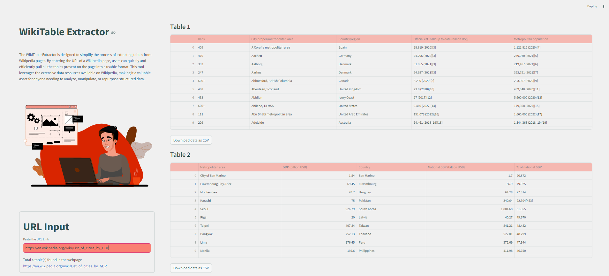

## WikiTable Extractor

### Background

The WikiTable Extractor is designed to simplify the process of extracting tables from Wikipedia pages. By entering the URL of a Wikipedia page, users can quickly and efficiently pull all the tables present on the page into a usable format. This tool leverages the extensive data resources available on Wikipedia, making it a valuable asset for anyone needing to analyze, manipulate, or repurpose structured data.

#### Potential Use Cases
- Academics and researchers can extract statistical data and other structured information for analysis without manual copying.
- Data scientists can quickly gather datasets for machine learning, data visualization, and other data-driven projects.
- Teachers and students can use the extracted tables for assignments, presentations, and educational materials.
- Businesses can pull relevant market data, financial statistics, and other information to support decision-making processes.
- Journalists and content creators can quickly obtain data to support articles, reports, and multimedia content.
- Hobbyists and enthusiasts can use the tool to gather data for personal projects, such as sports statistics, historical records, or hobby-related information.

⏩ <a href ="https://wikipediatableextracto-hrd5pkiygh7wjk8zsmf4ac.streamlit.app/">Web Application</a>
